<p align="center">
  
</p>

<h1 align="center">
  <a href="https://git.io/typing-svg">
    
  </a>
</h1>

<p align="center">
  
  <a href="https://github.com/laojichao">
    
  </a>
  <a href="https://github.com/laojichao?tab=repositories">
    
  </a>
</p>

---

## 📌 关于我

```javascript
const laojichao = {
  name: "JiChao",
  role: "Full Stack Developer",
  location: "China",
  code: ["JavaScript", "TypeScript", "Python", "Java", "Kotlin"],
  frontend: ["React", "Vue", "Tailwind CSS"],
  backend: ["Node.js", "Spring Boot", "Django"],
  mobile: ["Android", "Kotlin", "Jetpack Compose"],
  devops: ["Docker", "Kubernetes", "GitHub Actions"],
  database: ["MySQL", "PostgreSQL", "Redis", "MongoDB"],
  hobbies: ["Coding", "Reading", "Gaming", "Coffee"],
  motto: "Code for fun, build for impact!"
};
```

---

## 🛠️ 技术栈

<p align="center">
  
  
  
  
  
  
  
  
  
  
  
  
</p>

---

## 📊 GitHub 统计

<p align="center">
  
  
</p>

<p align="center">
  
</p>

---

## 🚀 贡献蛇

<p align="center">
  <picture>
    <source media="(prefers-color-scheme: dark)" srcset="./profile/snake-dark.svg">
    <source media="(prefers-color-scheme: light)" srcset="./profile/snake.svg">
    
  </picture>
</p>

---

## 📫 联系我

<p align="center">
  <a href="https://github.com/laojichao">
    
  </a>
  <a href="mailto:example@example.com">
    
  </a>
  <a href="https://laojichao.github.io">
    
  </a>
</p>

<p align="center">
  
</p>